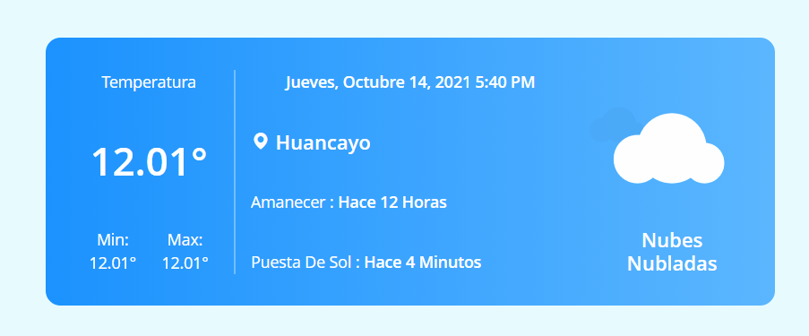

# App de Clima en Vue + Nuxt

Hola te dejo este ejemplode un app de Clima usando **Vue con Nuxt** , en este pequeño ejemplo podras ver como consumir una API de Clima asi como separar tu aplicacion en pequeños componentes que se encargaran de realizar operaciones especificaas

<p style="text-align:center"></p>

## Comenzando 🚀

_Estas instrucciones te permitirán obtener una copia del proyecto en funcionamiento en tu máquina local para propósitos de desarrollo y pruebas._

Solo sigue los siguientes comandos para poder ejecutarlo en tu maquina

```bash
# install dependencies
$ npm install

# serve with hot reload at localhost:3000
$ npm run dev

```

### Demo 🌐

_Puedes ver la demostracion del proyecto en el siguiente enlace_

- [Demo](https://vue-clima-app.web.app/)

## Construido con 🛠️

_Menciona las herramientas que utilizaste para crear tu proyecto_

- [VueJS](https://vuejs.org/)
- [Nuxt](https://nuxtjs.org/)
- [openweathermap](https://openweathermap.org/) - Api del Clima

## Contribuyendo 🖇️

Si va a usar el proyecto por favor envíame el pull requests y dejame una estrella.

## Expresiones de Gratitud 🎁

- Comenta a otros sobre este proyecto 📢
- Da las gracias públicamente 🤓.
- etc.

---
